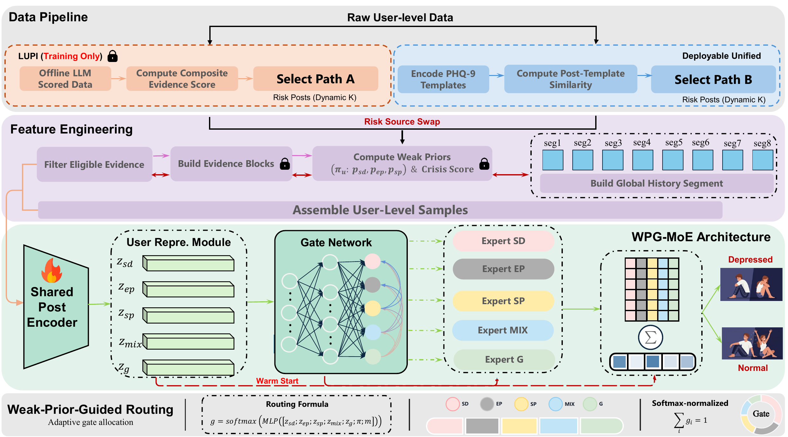
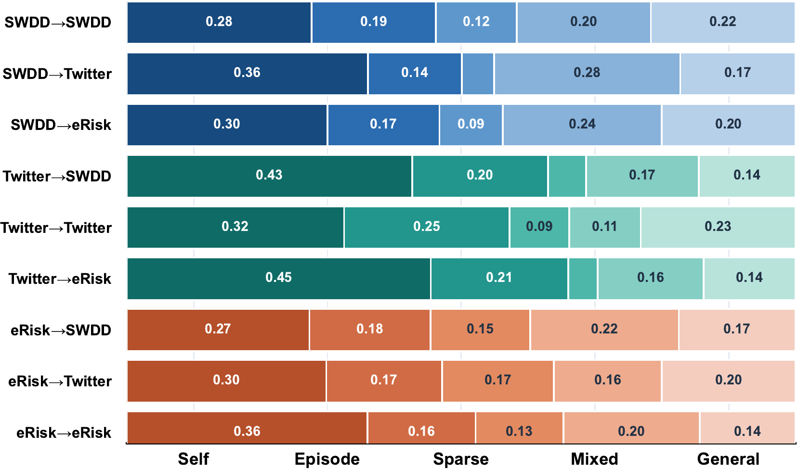
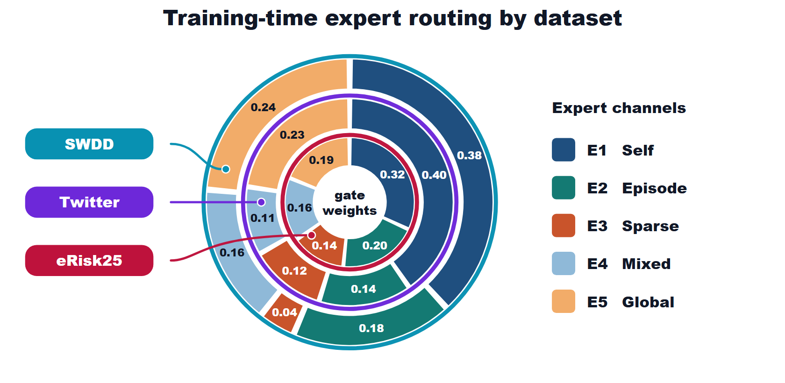

# WPG-MoE

<p align="center">
  <b>Weak-Prior-Guided Dense Mixture-of-Experts for user-level social media depression detection</b>
</p>

<p align="center">
  
  
  
  
</p>

WPG-MoE is the public implementation of our weak-prior-guided dense MoE model for user-level depression detection. The code focuses on the trainable model, routing losses, user formatting, and experiment templates. Data files, checkpoints, offline scoring utilities, and private annotation pipelines are not included.

<p align="center">
  
</p>

## What is included

- Five expert views for self-disclosure, episode-supported evidence, sparse evidence, mixed evidence, and global user context.
- Dense MoE inference: every expert is evaluated, then fused through a learned gate.
- Weak-prior-guided training losses for routing and evidence selection.
- Warm-start and joint-training entrypoints for the released experiment templates.
- Routing diagnostics for in-domain and cross-dataset transfer.

<table>
  <tr>
    <td width="58%" align="center" valign="top">
      
      <br>
      <sub>Source-target gate allocation.</sub>
    </td>
    <td width="42%" align="center" valign="top">
      
      <br>
      <sub>Training-time expert routing by dataset.</sub>
    </td>
  </tr>
</table>

## Repository layout

```text
src/model/       backbone wrapper, user views, gate, experts, MoE head, evidence head
src/features/    weak priors, evidence blocks, and global-history utilities
src/training/    dataset formatting, losses, warm start, joint training, scheduling
src/utils/       config loading, schemas, and I/O helpers
configs/         SWDD, Twitter, and eRisk training templates
scripts/         training entrypoints
assets/          README figures
```

## Environment used

These versions come from the server `base` environment used for this upload:

```text
Python       3.11.13
PyTorch      2.7.0+cu128
Transformers 4.57.3
Accelerate   1.12.0
```

Install the package requirements before training:

```bash
pip install -r requirements.txt
```

## Quick start

Edit one of the YAML files in `configs/` first. At minimum, set the local backbone path or Hugging Face model name and point `train_path`, `val_path`, and `test_path` to your prepared JSONL files.

```bash
python scripts/train_stage_de.py \
  --config configs/swdd_qwen35_stage_de_fullparam.yaml \
  --device cuda:0
```

For a different dataset template:

```bash
python scripts/train_stage_de.py \
  --config configs/twitter_qwen35_stage_de_fullparam.yaml \
  --device cuda:0
```

## Data access and privacy

The paper uses three user-level social-media datasets: SWDD, the Twitter depression dataset, and eRisk25. Each source is normalized into timestamped user histories, then converted into WPG-MoE training samples. Source-training users may include offline weak-prior evidence; validation, test, transfer-target, and deployment-style users rely on deployable screening and the shared backbone.

The unified 80/10/10 split is for controlled method comparison. It does not replace dataset-specific leaderboards or the official eRisk early-detection protocol.

The processed samples add three layers used by the model: audited user labels and controlled splits, LLM weak-prior scores plus PHQ-9-template risk-post scores, and compact user-level histories with temporal segments and summary statistics. These additions support the routing and evidence losses in the released code while keeping inference tied to deployable screening.

We do not redistribute raw posts, normalized user histories, LLM-derived evidence labels, or annotation packets. These records can contain mental-health self-disclosure, crisis language, and other sensitive text. Public release would create avoidable privacy risk and may conflict with dataset agreements or platform terms.

| Need | Route |
| --- | --- |
| Original datasets | Apply through the official dataset providers. eRisk25, for example, requires a research-only user agreement and email request on the [official eRisk page](https://erisk.irlab.org/eRisk2025.html). |
| WPG-MoE processed samples | Contact the authors at [s-lx25@bza.edu.cn](mailto:s-lx25@bza.edu.cn) with your affiliation, intended use, and evidence that you already have permission to use the source data. |
| Code-only experiments | Use your own authorized user-level data and point the YAML paths in `configs/` to those files. |

## Notes

- The release is intended for research reproduction and follow-up experiments.
- Checkpoints, private datasets, baseline runs, ablation scripts, and offline scoring code are excluded.
- The default configs assume a Qwen3.5-2B style backbone path. Replace it with a path available on your machine.

## Citation

Citation information will be added after publication.
