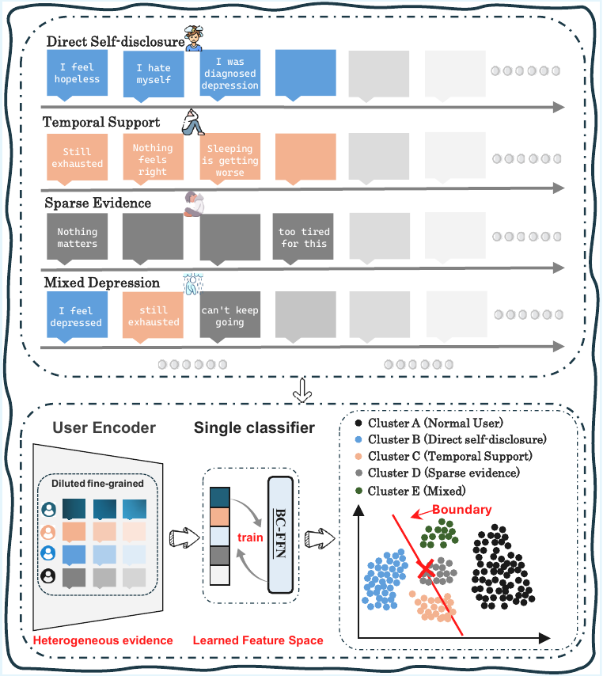

# WPG-MoE

**Weak-Prior-Guided Dense Mixture-of-Experts for User-Level Social Media Depression Detection**

WPG-MoE is a compact implementation of the main algorithm described in our paper. It uses weak semantic priors to guide dense expert routing, while keeping inference deployable through the shared backbone and user-level evidence representations.

<p align="center">
  
</p>

## Highlights

- **Weak-prior-guided routing** over self-disclosure, episode-supported, sparse-evidence, mixed, and global expert views.
- **Dense MoE prediction** where all experts are evaluated and softly fused for each user.
- **LUPI-style training boundary**: privileged weak-prior signals shape training, while the released package focuses on the model and training algorithm.
- **Interpretable routing behavior** through five-way gate weights and evidence-aware fusion.

<p align="center">
  
  
</p>

## Code

```text
src/model/       WPG-MoE backbone, user views, gate, experts, dense MoE, evidence head
src/features/    Evidence blocks, weak priors, and global-history utilities
src/training/    User formatting, routing/evidence losses, warm start, joint training
configs/         Main Qwen3.5-2B experiment templates
scripts/         Training entrypoints
```

This public version intentionally excludes datasets, model checkpoints, offline scoring code, template screening code, baselines, and ablation scripts.

## Quick Start

```bash
pip install -r requirements.txt
```

Prepare user-level JSONL files with the fields consumed by `src/training/dataset.py`, then update the paths and backbone in `configs/*.yaml`.

```bash
python scripts/train_stage_de.py \
  --config configs/swdd_qwen35_stage_de_fullparam.yaml \
  --device cuda:0
```

## Data

Datasets are not included. The training code expects pre-built user samples containing risk posts, optional weak priors, optional episode blocks, global history segments, and labels.

## Citation

Citation information will be added after publication.
